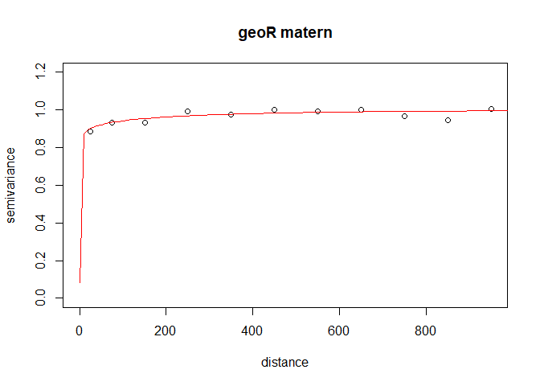
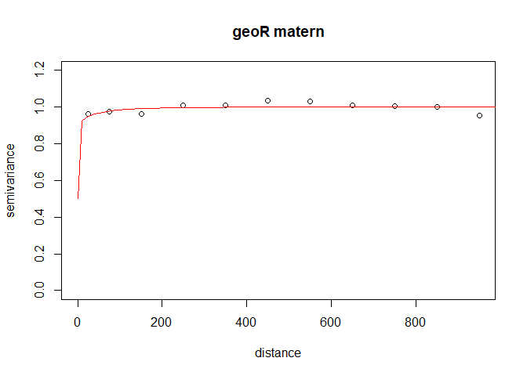
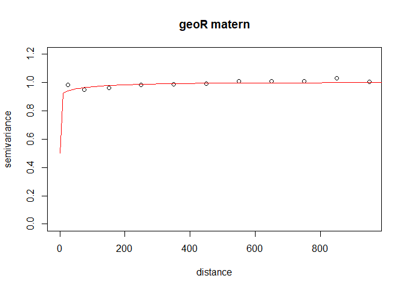
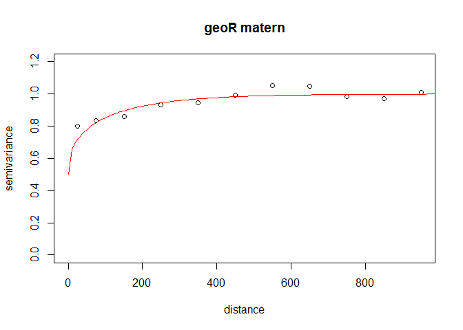
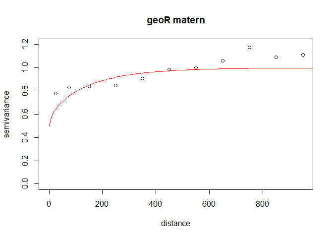

------------------------------------------------------------------------

# Introduction

Here we give an introduction to the package “splda” in R! We follow the
methods described in:

Suesse, T., Grupp. V., Brenning, A. “Spatial Linear Discriminant
Analysis Approaches for Remote-Sensing Classification” (2023)

We do a sample analysis on the Aconcaguia data set. The data in the
package has been preprocessed.

``` r
# install.packages(devtools)
# library(devtools)
# devtools::install_github("tsuesse/splda")
```

## Data and Methods

We are using the Aconcagua data set derived from Nine cloud-free
Landsat-8 images from one growing season with six fruit-tree crop types
using 72 spectral features in total, including vegetation indices that
were derived from the raw spectral data. The geolocations of pixels are
given as (projected) UTM coordinates. The data set includes
*n* = 15, 268 image pixels corresponding to *N* = 1, 525 agricultural
fields. The aim is to classify the croptype of each field.

Aconcagua data set has the following objects \* **data_original**
original data set Aconcagua \* **data_generated** data : new data set
with artificial coordinates and features generated from multivariate
normal with only *n* = 14, 400 pixels and 1, 600 fields \* **formula**
formula for LDA \* **predictors** predictors for LDA

``` r
library(splda)
#> Lade nötiges Paket: MASS
#> Lade nötiges Paket: mda
#> Lade nötiges Paket: class
#> Loaded mda 0.5-3
#> Lade nötiges Paket: proxy
#> 
#> Attache Paket: 'proxy'
#> Die folgenden Objekte sind maskiert von 'package:stats':
#> 
#>     as.dist, dist
#> Das folgende Objekt ist maskiert 'package:base':
#> 
#>     as.matrix
#> Lade nötiges Paket: tibble
#> Lade nötiges Paket: Matrix
#> Lade nötiges Paket: formula.tools
#> Lade nötiges Paket: geoR
#> --------------------------------------------------------------
#>  Analysis of Geostatistical Data
#>  For an Introduction to geoR go to http://www.leg.ufpr.br/geoR
#>  geoR version 1.9-2 (built on 2022-08-09) is now loaded
#> --------------------------------------------------------------
#> Lade nötiges Paket: dplyr
#> 
#> Attache Paket: 'dplyr'
#> Das folgende Objekt ist maskiert 'package:MASS':
#> 
#>     select
#> Die folgenden Objekte sind maskiert von 'package:stats':
#> 
#>     filter, lag
#> Die folgenden Objekte sind maskiert von 'package:base':
#> 
#>     intersect, setdiff, setequal, union
#> Lade nötiges Paket: GenSA
str(data_original)
#> 'data.frame':    15268 obs. of  76 variables:
#>  $ croptype: Factor w/ 6 levels "crop1","crop2",..: 1 1 1 1 1 1 1 1 1 1 ...
#>  $ field   : int  1 1 1 1 2 2 2 2 2 2 ...
#>  $ utmx    : num  350925 350895 350925 350895 350595 ...
#>  $ utmy    : num  6359605 6359605 6359575 6359575 6361945 ...
#>  $ b12     : int  339 344 336 351 384 409 381 372 385 357 ...
#>  $ b13     : int  499 506 516 518 579 605 564 552 560 527 ...
#>  $ b14     : int  639 644 647 665 849 881 849 824 831 798 ...
#>  $ b15     : int  1672 1660 1793 1747 1740 1727 1708 1686 1669 1636 ...
#>  $ b16     : int  1707 1764 1803 1824 2260 2237 2255 2202 2189 2127 ...
#>  $ b17     : int  1314 1345 1338 1390 1729 1733 1727 1706 1678 1617 ...
#>  $ b22     : int  218 222 216 227 250 268 248 241 251 231 ...
#>  $ b23     : int  367 373 380 381 425 443 413 405 411 387 ...
#>  $ b24     : int  492 496 498 511 646 669 646 628 633 609 ...
#>  $ b25     : int  1300 1291 1392 1357 1349 1338 1325 1308 1294 1270 ...
#>  $ b26     : int  1326 1369 1399 1416 1751 1733 1747 1706 1697 1649 ...
#>  $ b27     : int  1019 1043 1037 1077 1339 1342 1337 1321 1300 1253 ...
#>  $ b32     : int  495 496 509 498 519 530 503 513 512 480 ...
#>  $ b33     : int  658 648 679 659 690 725 678 696 702 641 ...
#>  $ b34     : int  722 712 755 736 794 863 791 810 815 740 ...
#>  $ b35     : int  2053 2032 1986 1994 2642 2545 2643 2613 2513 2437 ...
#>  $ b36     : int  1554 1565 1613 1599 2207 2217 2219 2207 2189 2095 ...
#>  $ b37     : int  1113 1105 1161 1140 1444 1495 1432 1432 1463 1381 ...
#>  $ b42     : int  254 232 254 242 301 357 279 308 337 308 ...
#>  $ b43     : int  494 468 486 480 536 576 503 518 541 507 ...
#>  $ b44     : int  369 327 379 344 524 601 477 521 585 535 ...
#>  $ b45     : int  3411 3570 3335 3486 3138 3074 3200 3118 3067 3130 ...
#>  $ b46     : int  1424 1390 1463 1430 1686 1789 1632 1687 1789 1785 ...
#>  $ b47     : int  706 672 743 713 925 1050 850 917 988 964 ...
#>  $ b52     : int  199 192 218 222 240 297 218 244 287 284 ...
#>  $ b53     : int  449 410 462 454 459 526 424 461 488 477 ...
#>  $ b54     : int  324 303 327 339 472 589 417 450 515 523 ...
#>  $ b55     : int  3461 3431 3411 3395 2987 2925 3031 3005 2969 2970 ...
#>  $ b56     : int  1340 1309 1383 1375 1536 1672 1479 1528 1647 1658 ...
#>  $ b57     : int  635 610 670 655 795 917 745 810 903 901 ...
#>  $ b62     : int  190 178 191 191 281 303 252 277 294 274 ...
#>  $ b63     : int  340 319 359 346 551 562 521 538 511 479 ...
#>  $ b64     : int  318 286 342 325 553 622 494 528 550 528 ...
#>  $ b65     : int  2146 2179 2182 2148 3155 2993 3267 3115 2967 2879 ...
#>  $ b66     : int  1159 1125 1198 1190 1925 1892 1895 1917 1780 1652 ...
#>  $ b67     : int  676 647 699 698 1016 1046 969 1004 968 891 ...
#>  $ b72     : int  206 168 210 187 280 287 249 273 263 220 ...
#>  $ b73     : int  342 305 368 330 534 516 509 533 494 395 ...
#>  $ b74     : int  372 328 401 373 635 631 591 636 583 445 ...
#>  $ b75     : int  2037 2048 2028 1992 3078 2919 3157 3088 2975 2775 ...
#>  $ b76     : int  1177 1151 1191 1201 1850 1752 1827 1837 1680 1519 ...
#>  $ b77     : int  720 685 740 726 998 1002 947 974 898 817 ...
#>  $ b82     : int  226 214 228 231 310 310 296 309 293 262 ...
#>  $ b83     : int  382 344 412 396 559 552 526 560 491 432 ...
#>  $ b84     : int  418 361 447 453 658 666 603 640 562 500 ...
#>  $ b85     : int  1993 1981 2009 1994 2953 2749 2983 2971 2762 2581 ...
#>  $ b86     : int  1209 1160 1227 1234 1842 1772 1750 1812 1669 1501 ...
#>  $ b87     : int  730 687 750 735 999 1006 933 966 904 826 ...
#>  $ b92     : int  190 186 210 211 295 316 278 291 282 252 ...
#>  $ b93     : int  341 311 353 342 504 500 471 498 456 406 ...
#>  $ b94     : int  291 262 313 309 548 571 499 535 484 415 ...
#>  $ b95     : int  2233 2186 2215 2170 2978 2862 2943 2929 2872 2748 ...
#>  $ b96     : int  1078 1048 1113 1105 1730 1671 1644 1698 1576 1417 ...
#>  $ b97     : int  565 532 603 594 915 932 858 894 834 739 ...
#>  $ ndvi01  : num  0.447 0.441 0.47 0.449 0.344 ...
#>  $ ndvi02  : num  0.451 0.445 0.473 0.453 0.352 ...
#>  $ ndvi03  : num  0.48 0.481 0.449 0.461 0.538 ...
#>  $ ndvi04  : num  0.805 0.832 0.796 0.82 0.714 ...
#>  $ ndvi05  : num  0.829 0.838 0.825 0.818 0.727 ...
#>  $ ndvi06  : num  0.742 0.768 0.729 0.737 0.702 ...
#>  $ ndvi07  : num  0.691 0.724 0.67 0.685 0.658 ...
#>  $ ndvi08  : num  0.653 0.692 0.636 0.63 0.636 ...
#>  $ ndvi09  : num  0.769 0.786 0.752 0.751 0.689 ...
#>  $ ndwi01  : num  -0.0104 -0.0304 -0.0028 -0.0216 -0.13 ...
#>  $ ndwi02  : num  -0.0099 -0.0293 -0.0025 -0.0213 -0.1297 ...
#>  $ ndwi03  : num  0.1383 0.1298 0.1036 0.1099 0.0897 ...
#>  $ ndwi04  : num  0.411 0.44 0.39 0.418 0.301 ...
#>  $ ndwi05  : num  0.442 0.448 0.423 0.423 0.321 ...
#>  $ ndwi06  : num  0.299 0.319 0.291 0.287 0.242 ...
#>  $ ndwi07  : num  0.268 0.28 0.26 0.248 0.249 ...
#>  $ ndwi08  : num  0.245 0.261 0.242 0.235 0.232 ...
#>  $ ndwi09  : num  0.349 0.352 0.331 0.325 0.265 ...
str(data_generated)
#> 'data.frame':    14400 obs. of  76 variables:
#>  $ croptype: Factor w/ 6 levels "crop1","crop2",..: 1 1 1 1 1 1 1 1 1 4 ...
#>  $ field   : int  1 1 1 1 1 1 1 1 1 2 ...
#>  $ utmx    : num  10 10 10 20 20 20 30 30 30 10 ...
#>  $ utmy    : num  10 20 30 10 20 30 10 20 30 40 ...
#>  $ b12     : num  123.6 308.2 10.4 106.8 232.1 ...
#>  $ b13     : num  255.6 393.48 -8.65 55.58 382.54 ...
#>  $ b14     : num  -103.7 -186.2 -79.7 -205.3 123.6 ...
#>  $ b15     : num  3952 2537 2384 1593 3753 ...
#>  $ b16     : num  1482 460 504 -476 1302 ...
#>  $ b17     : num  379 196 -211 -441 190 ...
#>  $ b22     : num  65.3 198.2 -16.5 51.1 146.3 ...
#>  $ b23     : num  194.01 292.86 1.61 45.95 288.15 ...
#>  $ b24     : num  -51.5 -114.3 -36.9 -132.7 117.7 ...
#>  $ b25     : num  3028 1952 1832 1240 2882 ...
#>  $ b26     : num  1157 370 400 -355 1019 ...
#>  $ b27     : num  300 156 -158 -337 152 ...
#>  $ b32     : num  -60.3 325 335.8 321.8 452.3 ...
#>  $ b33     : num  -198 223 200 228 289 ...
#>  $ b34     : num  -85.2 588.9 553.7 444.2 991.3 ...
#>  $ b35     : num  2793 1903 2419 -177 731 ...
#>  $ b36     : num  1513 1711 2432 187 3157 ...
#>  $ b37     : num  700 1272 1521 658 2418 ...
#>  $ b42     : num  432 521 518 410 534 ...
#>  $ b43     : num  328 510 669 519 617 ...
#>  $ b44     : num  1069 1274 1103 890 1100 ...
#>  $ b45     : num  662 755 4323 1416 2855 ...
#>  $ b46     : num  1996 2713 3016 2002 3104 ...
#>  $ b47     : num  1410 1946 1579 1269 1899 ...
#>  $ b52     : num  425 445 475 466 496 ...
#>  $ b53     : num  300 401 568 568 538 ...
#>  $ b54     : num  1030 987 1100 978 1004 ...
#>  $ b55     : num  -459 183 2739 375 2059 ...
#>  $ b56     : num  1552 1929 2521 1816 2552 ...
#>  $ b57     : num  1354 1532 1533 1290 1691 ...
#>  $ b62     : num  417 364 442 425 381 ...
#>  $ b63     : num  280 315 479 494 425 ...
#>  $ b64     : num  1093 937 1068 945 939 ...
#>  $ b65     : num  -566 524 3014 882 2515 ...
#>  $ b66     : num  1443 1800 2505 1767 2468 ...
#>  $ b67     : num  1347 1482 1584 1313 1564 ...
#>  $ b72     : num  195 236 213 229 257 ...
#>  $ b73     : num  28.7 210.7 256.9 279.8 306.4 ...
#>  $ b74     : num  809 770 755 720 804 ...
#>  $ b75     : num  -205 671 2921 1258 2627 ...
#>  $ b76     : num  1142 1731 2176 1383 2227 ...
#>  $ b77     : num  1123 1379 1298 1004 1434 ...
#>  $ b82     : num  246 295 380 332 304 ...
#>  $ b83     : num  141 271 389 375 289 ...
#>  $ b84     : num  757 703 871 808 650 ...
#>  $ b85     : num  -235 529 2155 727 2367 ...
#>  $ b86     : num  1163 1697 2184 1373 2040 ...
#>  $ b87     : num  1223 1428 1528 1188 1438 ...
#>  $ b92     : num  279 281 337 415 355 ...
#>  $ b93     : num  111 248 342 450 354 ...
#>  $ b94     : num  728 644 664 907 687 ...
#>  $ b95     : num  -607 109 1651 182 1921 ...
#>  $ b96     : num  1141 1554 2011 1472 2062 ...
#>  $ b97     : num  1145 1348 1347 1241 1391 ...
#>  $ ndvi01  : num  1.265 1.009 0.947 0.837 1.105 ...
#>  $ ndvi02  : num  1.253 1.001 0.94 0.838 1.094 ...
#>  $ ndvi03  : num  0.907 0.484 0.585 0.297 0.117 ...
#>  $ ndvi04  : num  0.299 0.209 0.5 0.486 0.343 ...
#>  $ ndvi05  : num  0.27 0.309 0.453 0.416 0.383 ...
#>  $ ndvi06  : num  0.204 0.309 0.444 0.434 0.406 ...
#>  $ ndvi07  : num  0.386 0.454 0.597 0.544 0.525 ...
#>  $ ndvi08  : num  0.332 0.371 0.49 0.421 0.582 ...
#>  $ ndvi09  : num  0.383 0.428 0.579 0.354 0.593 ...
#>  $ ndwi01  : num  0.605 0.438 0.445 0.462 0.587 ...
#>  $ ndwi02  : num  0.591 0.427 0.436 0.457 0.575 ...
#>  $ ndwi03  : num  0.27299 0.05962 0.00223 0.04707 -0.46233 ...
#>  $ ndwi04  : num  -0.129 -0.2884 0.0833 0.0397 -0.1302 ...
#>  $ ndwi05  : num  -0.1496 -0.1725 0.0488 -0.0275 -0.0566 ...
#>  $ ndwi06  : num  -0.164 -0.1483 0.0525 0.0201 -0.0134 ...
#>  $ ndwi07  : num  0.0221 -0.0189 0.1799 0.1858 0.1404 ...
#>  $ ndwi08  : num  -0.0614 -0.1155 0.0555 0.0295 0.1149 ...
#>  $ ndwi09  : num  -0.0931 -0.1617 0.044 -0.0498 0.0561 ...

block<-"field"
n_blocks<-100 # sample of n_blocks fields
trace<-2 # 1 less output, 2 more output
coords <- c("utmx", "utmy")
```

``` r
data <- data_original # use original data set
data <- data_generated # alternatively use generated data set, uncomment to use it

# obtaina sample via 
s_srs<-obtain_sample_SRS(data, block, ns=ceiling(n_blocks/6), equal.n.var="croptype")$s
```

First we apply standard LDA and apply the majority filter

``` r
# simple LDA pixelwise: LDA function of MASS package
data_train<-data[s_srs,]
data_test<-data[-s_srs,]
fittest <- MASS::lda(formula, data_train)
pred_lda <- predict(fittest, newdata = data_test, type = response)
cat("error rate LDA",mean(pred_lda$class != data$croptype[-s_srs]),"\n")
#> error rate LDA 0.3208723

# majority filter
data_test1<-data_test
data_test1[,"field"]<-as.factor(data_test1[,"field"])
fac <- block # fac defines field level for majority filter
pred_maj <- lda_predmaj(fittest, newdata = data_test1, fac = "field")
cat("error rate majority filter",mean(pred_maj != data$croptype[-s_srs]),"\n")
#> error rate majority filter 0.1188251
```

Next we train the spatial model on the transformed feature data, first
without coordinates and then with coordinates. For each component
*l* = 1, ..., *L* of the transformed feature vectors a spatial
stationary and isotropic covariance model is fitted.

``` r
# use lda_sp without coordinates, independence imposed on pixels
  fit_ind <- lda_sp(
    formula = formula, data = data_train, covs_equal = TRUE, trace = trace,
    cov_models = NULL,phi_max=800
  ) # train
#> No covariance models are given. Non spatial fit will be returned.


  # use lda_sp with coordinates
fit_sp <- lda_sp(
  formula = formula, data = data_train, covs_equal = TRUE, trace = trace,coords = coords,
  cov_models = c("matern" ,"exponential","gaussian", "spherical"),max_dist=1000,showplot=TRUE,ini=c(500,0.2),phi_max=800,fixed.model=NULL) 
#> Spatial correlation modelling starts...
#>  
#> Max distance used 1000 
#>  
#> pars= 500 0.2  (phi,tausq)
#> variog: computing omnidirectional variogram
#> variogram finished
#> Fit Model= matern 
#> variofit: covariance model used is matern 
#> variofit: weights used: npairs 
#> variofit: minimisation function used: optim 
#> ############### BEGIN SANN ################
#> Cov-model matern 
#> final value SANN 127.9082 
#> ############### END SANN - BEGIN OPTIM ################
#> N = 3, M = 5 machine precision = 2.22045e-16
#> Line search cannot locate an adequate point after 20 function
#> and gradient evaluations
#> final  value 127.908194 
#> stopped after 0 iterations
#> ############### END  OPTIM ################
#> prac-range start
#> prac-range end
#> variofit: model parameters estimated by WLS (weighted least squares):
#> covariance model is: matern
#> parameter estimates:
#>    tausq  sigmasq      phi    kappa 
#>   0.3958   0.6042 800.0000   0.0183 
#> Practical Range with cor=0.05 for asymptotic range: NULL
#> 
#> variofit: minimised weighted sum of squares = 127.9082
#> Fit Model= exponential 
#> variofit: covariance model used is exponential 
#> variofit: weights used: npairs 
#> variofit: minimisation function used: optim 
#> ############### BEGIN SANN ################
#> Cov-model exponential 
#> final value SANN 292.8631 
#> ############### END SANN - BEGIN OPTIM ################
#> N = 3, M = 5 machine precision = 2.22045e-16
#> 
#> iterations 0
#> function evaluations 1
#> segments explored during Cauchy searches 0
#> BFGS updates skipped 0
#> active bounds at final generalized Cauchy point 0
#> norm of the final projected gradient 0
#> final function value 292.863
#> 
#> final  value 292.863108 
#> converged
#> ############### END  OPTIM ################
#> prac-range start
#> prac-range end
#> variofit: model parameters estimated by WLS (weighted least squares):
#> covariance model is: exponential
#> parameter estimates:
#>   tausq sigmasq     phi   kappa 
#>  0.5000  0.5000 20.0000  4.2941 
#> Practical Range with cor=0.05 for asymptotic range: NULL
#> 
#> variofit: minimised weighted sum of squares = 292.8631
#> Fit Model= gaussian 
#> variofit: covariance model used is gaussian 
#> variofit: weights used: npairs 
#> variofit: minimisation function used: optim 
#> ############### BEGIN SANN ################
#> Cov-model gaussian 
#> final value SANN 278.3142 
#> ############### END SANN - BEGIN OPTIM ################
#> N = 3, M = 5 machine precision = 2.22045e-16
#> 
#> iterations 0
#> function evaluations 1
#> segments explored during Cauchy searches 0
#> BFGS updates skipped 0
#> active bounds at final generalized Cauchy point 0
#> norm of the final projected gradient 0
#> final function value 278.314
#> 
#> final  value 278.314194 
#> converged
#> ############### END  OPTIM ################
#> prac-range start
#> prac-range end
#> variofit: model parameters estimated by WLS (weighted least squares):
#> covariance model is: gaussian
#> parameter estimates:
#>   tausq sigmasq     phi   kappa 
#>  0.5000  0.5000 20.0000  4.2941 
#> Practical Range with cor=0.05 for asymptotic range: NULL
#> 
#> variofit: minimised weighted sum of squares = 278.3142
#> Fit Model= spherical 
#> variofit: covariance model used is spherical 
#> variofit: weights used: npairs 
#> variofit: minimisation function used: optim 
#> ############### BEGIN SANN ################
#> Cov-model spherical 
#> final value SANN 271.0988 
#> ############### END SANN - BEGIN OPTIM ################
#> N = 3, M = 5 machine precision = 2.22045e-16
#> 
#> iterations 1
#> function evaluations 3
#> segments explored during Cauchy searches 1
#> BFGS updates skipped 0
#> active bounds at final generalized Cauchy point 0
#> norm of the final projected gradient 1.35572e-08
#> final function value 271.099
#> 
#> final  value 271.098774 
#> converged
#> ############### END  OPTIM ################
#> prac-range start
#> prac-range end
#> variofit: model parameters estimated by WLS (weighted least squares):
#> covariance model is: spherical
#> parameter estimates:
#>   tausq sigmasq     phi   kappa 
#>  0.3112  0.6888 34.2848 12.8383 
#> Practical Range with cor=0.05 for asymptotic range: NULL
#> 
#> variofit: minimised weighted sum of squares = 271.0988
```



    #> **************************************************************************
    #> Model chosen for Variable l = 1  is  matern 
    #> with Parameters  0.395802 800 0.604198 0.01831564  (tausq,phi,sigmasq,kappa)
    #> Practical Range with Corr<0.01 is 1053.05 
    #> **************************************************************************
    #> pars= 500 0.2  (phi,tausq)
    #> variog: computing omnidirectional variogram
    #> variogram finished
    #> Fit Model= matern 
    #> variofit: covariance model used is matern 
    #> variofit: weights used: npairs 
    #> variofit: minimisation function used: optim 
    #> ############### BEGIN SANN ################
    #> Cov-model matern 
    #> final value SANN 118.7445 
    #> ############### END SANN - BEGIN OPTIM ################
    #> N = 3, M = 5 machine precision = 2.22045e-16
    #> Line search cannot locate an adequate point after 20 function
    #> and gradient evaluations
    #> final  value 118.744523 
    #> stopped after 0 iterations
    #> ############### END  OPTIM ################
    #> prac-range start
    #> prac-range end
    #> variofit: model parameters estimated by WLS (weighted least squares):
    #> covariance model is: matern
    #> parameter estimates:
    #>    tausq  sigmasq      phi    kappa 
    #>   0.5000   0.5000 198.8940   0.0325 
    #> Practical Range with cor=0.05 for asymptotic range: NULL
    #> 
    #> variofit: minimised weighted sum of squares = 118.7445
    #> Fit Model= exponential 
    #> variofit: covariance model used is exponential 
    #> variofit: weights used: npairs 
    #> variofit: minimisation function used: optim 
    #> ############### BEGIN SANN ################
    #> Cov-model exponential 
    #> final value SANN 221.1046 
    #> ############### END SANN - BEGIN OPTIM ################
    #> N = 3, M = 5 machine precision = 2.22045e-16
    #> 
    #> iterations 0
    #> function evaluations 1
    #> segments explored during Cauchy searches 0
    #> BFGS updates skipped 0
    #> active bounds at final generalized Cauchy point 0
    #> norm of the final projected gradient 0
    #> final function value 221.105
    #> 
    #> final  value 221.104571 
    #> converged
    #> ############### END  OPTIM ################
    #> prac-range start
    #> prac-range end
    #> variofit: model parameters estimated by WLS (weighted least squares):
    #> covariance model is: exponential
    #> parameter estimates:
    #>   tausq sigmasq     phi   kappa 
    #>  0.5000  0.5000 20.0000  4.2941 
    #> Practical Range with cor=0.05 for asymptotic range: NULL
    #> 
    #> variofit: minimised weighted sum of squares = 221.1046
    #> Fit Model= gaussian 
    #> variofit: covariance model used is gaussian 
    #> variofit: weights used: npairs 
    #> variofit: minimisation function used: optim 
    #> ############### BEGIN SANN ################
    #> Cov-model gaussian 
    #> final value SANN 190.4787 
    #> ############### END SANN - BEGIN OPTIM ################
    #> N = 3, M = 5 machine precision = 2.22045e-16
    #> 
    #> iterations 0
    #> function evaluations 1
    #> segments explored during Cauchy searches 0
    #> BFGS updates skipped 0
    #> active bounds at final generalized Cauchy point 0
    #> norm of the final projected gradient 0
    #> final function value 190.479
    #> 
    #> final  value 190.478661 
    #> converged
    #> ############### END  OPTIM ################
    #> prac-range start
    #> prac-range end
    #> variofit: model parameters estimated by WLS (weighted least squares):
    #> covariance model is: gaussian
    #> parameter estimates:
    #>   tausq sigmasq     phi   kappa 
    #>  0.5000  0.5000 20.0000  4.2941 
    #> Practical Range with cor=0.05 for asymptotic range: NULL
    #> 
    #> variofit: minimised weighted sum of squares = 190.4787
    #> Fit Model= spherical 
    #> variofit: covariance model used is spherical 
    #> variofit: weights used: npairs 
    #> variofit: minimisation function used: optim 
    #> ############### BEGIN SANN ################
    #> Cov-model spherical 
    #> final value SANN 158.9134 
    #> ############### END SANN - BEGIN OPTIM ################
    #> N = 3, M = 5 machine precision = 2.22045e-16
    #> 
    #> iterations 1
    #> function evaluations 2
    #> segments explored during Cauchy searches 1
    #> BFGS updates skipped 0
    #> active bounds at final generalized Cauchy point 0
    #> norm of the final projected gradient 5.13865e-08
    #> final function value 158.913
    #> 
    #> final  value 158.913446 
    #> converged
    #> ############### END  OPTIM ################
    #> prac-range start
    #> prac-range end
    #> variofit: model parameters estimated by WLS (weighted least squares):
    #> covariance model is: spherical
    #> parameter estimates:
    #>   tausq sigmasq     phi   kappa 
    #>  0.2375  0.7625 29.9760 11.1538 
    #> Practical Range with cor=0.05 for asymptotic range: NULL
    #> 
    #> variofit: minimised weighted sum of squares = 158.9134



    #> **************************************************************************
    #> Model chosen for Variable l = 2  is  matern 
    #> with Parameters  0.5 198.894 0.5 0.03249196  (tausq,phi,sigmasq,kappa)
    #> Practical Range with Corr<0.01 is 351.8351 
    #> **************************************************************************
    #> pars= 500 0.2  (phi,tausq)
    #> variog: computing omnidirectional variogram
    #> variogram finished
    #> Fit Model= matern 
    #> variofit: covariance model used is matern 
    #> variofit: weights used: npairs 
    #> variofit: minimisation function used: optim 
    #> ############### BEGIN SANN ################
    #> Cov-model matern 
    #> final value SANN 127.4264 
    #> ############### END SANN - BEGIN OPTIM ################
    #> N = 3, M = 5 machine precision = 2.22045e-16
    #> Line search cannot locate an adequate point after 20 function
    #> and gradient evaluations
    #> final  value 127.426427 
    #> stopped after 0 iterations
    #> ############### END  OPTIM ################
    #> prac-range start
    #> prac-range end
    #> variofit: model parameters estimated by WLS (weighted least squares):
    #> covariance model is: matern
    #> parameter estimates:
    #>    tausq  sigmasq      phi    kappa 
    #>   0.5000   0.5000 178.2033   0.0590 
    #> Practical Range with cor=0.05 for asymptotic range: NULL
    #> 
    #> variofit: minimised weighted sum of squares = 127.4264
    #> Fit Model= exponential 
    #> variofit: covariance model used is exponential 
    #> variofit: weights used: npairs 
    #> variofit: minimisation function used: optim 
    #> ############### BEGIN SANN ################
    #> Cov-model exponential 
    #> final value SANN 225.3816 
    #> ############### END SANN - BEGIN OPTIM ################
    #> N = 3, M = 5 machine precision = 2.22045e-16
    #> 
    #> iterations 0
    #> function evaluations 1
    #> segments explored during Cauchy searches 0
    #> BFGS updates skipped 0
    #> active bounds at final generalized Cauchy point 0
    #> norm of the final projected gradient 0
    #> final function value 225.382
    #> 
    #> final  value 225.381561 
    #> converged
    #> ############### END  OPTIM ################
    #> prac-range start
    #> prac-range end
    #> variofit: model parameters estimated by WLS (weighted least squares):
    #> covariance model is: exponential
    #> parameter estimates:
    #>   tausq sigmasq     phi   kappa 
    #>  0.5000  0.5000 20.0000  4.2941 
    #> Practical Range with cor=0.05 for asymptotic range: NULL
    #> 
    #> variofit: minimised weighted sum of squares = 225.3816
    #> Fit Model= gaussian 
    #> variofit: covariance model used is gaussian 
    #> variofit: weights used: npairs 
    #> variofit: minimisation function used: optim 
    #> ############### BEGIN SANN ################
    #> Cov-model gaussian 
    #> final value SANN 217.4803 
    #> ############### END SANN - BEGIN OPTIM ################
    #> N = 3, M = 5 machine precision = 2.22045e-16
    #> 
    #> iterations 0
    #> function evaluations 1
    #> segments explored during Cauchy searches 0
    #> BFGS updates skipped 0
    #> active bounds at final generalized Cauchy point 0
    #> norm of the final projected gradient 0
    #> final function value 217.48
    #> 
    #> final  value 217.480277 
    #> converged
    #> ############### END  OPTIM ################
    #> prac-range start
    #> prac-range end
    #> variofit: model parameters estimated by WLS (weighted least squares):
    #> covariance model is: gaussian
    #> parameter estimates:
    #>   tausq sigmasq     phi   kappa 
    #>  0.5000  0.5000 20.0000  4.2941 
    #> Practical Range with cor=0.05 for asymptotic range: NULL
    #> 
    #> variofit: minimised weighted sum of squares = 217.4803
    #> Fit Model= spherical 
    #> variofit: covariance model used is spherical 
    #> variofit: weights used: npairs 
    #> variofit: minimisation function used: optim 
    #> ############### BEGIN SANN ################
    #> Cov-model spherical 
    #> final value SANN 212.7942 
    #> ############### END SANN - BEGIN OPTIM ################
    #> N = 3, M = 5 machine precision = 2.22045e-16
    #> 
    #> iterations 1
    #> function evaluations 3
    #> segments explored during Cauchy searches 1
    #> BFGS updates skipped 0
    #> active bounds at final generalized Cauchy point 0
    #> norm of the final projected gradient 4.02167e-09
    #> final function value 212.794
    #> 
    #> final  value 212.794181 
    #> converged
    #> ############### END  OPTIM ################
    #> prac-range start
    #> prac-range end
    #> variofit: model parameters estimated by WLS (weighted least squares):
    #> covariance model is: spherical
    #> parameter estimates:
    #>   tausq sigmasq     phi   kappa 
    #>  0.4534  0.5466 36.8735  0.2772 
    #> Practical Range with cor=0.05 for asymptotic range: NULL
    #> 
    #> variofit: minimised weighted sum of squares = 212.7942



    #> **************************************************************************
    #> Model chosen for Variable l = 3  is  matern 
    #> with Parameters  0.5 178.2033 0.5 0.05902917  (tausq,phi,sigmasq,kappa)
    #> Practical Range with Corr<0.01 is 405.6586 
    #> **************************************************************************
    #> pars= 500 0.2  (phi,tausq)
    #> variog: computing omnidirectional variogram
    #> variogram finished
    #> Fit Model= matern 
    #> variofit: covariance model used is matern 
    #> variofit: weights used: npairs 
    #> variofit: minimisation function used: optim 
    #> ############### BEGIN SANN ################
    #> Cov-model matern 
    #> final value SANN 201.9839 
    #> ############### END SANN - BEGIN OPTIM ################
    #> N = 3, M = 5 machine precision = 2.22045e-16
    #> 
    #> iterations 1
    #> function evaluations 21
    #> segments explored during Cauchy searches 1
    #> BFGS updates skipped 0
    #> active bounds at final generalized Cauchy point 1
    #> norm of the final projected gradient 0.00082139
    #> final function value 201.984
    #> 
    #> Warning:  more than 10 function and gradient evaluations
    #>    in the last line search
    #> final  value 201.983937 
    #> converged
    #> ############### END  OPTIM ################
    #> prac-range start
    #> prac-range end
    #> variofit: model parameters estimated by WLS (weighted least squares):
    #> covariance model is: matern
    #> parameter estimates:
    #>    tausq  sigmasq      phi    kappa 
    #>   0.5000   0.5000 425.4309   0.1210 
    #> Practical Range with cor=0.05 for asymptotic range: NULL
    #> 
    #> variofit: minimised weighted sum of squares = 201.9839
    #> Fit Model= exponential 
    #> variofit: covariance model used is exponential 
    #> variofit: weights used: npairs 
    #> variofit: minimisation function used: optim 
    #> ############### BEGIN SANN ################
    #> Cov-model exponential 
    #> final value SANN 568.5608 
    #> ############### END SANN - BEGIN OPTIM ################
    #> N = 3, M = 5 machine precision = 2.22045e-16
    #> Line search cannot locate an adequate point after 20 function
    #> and gradient evaluations
    #> final  value 568.560759 
    #> stopped after 0 iterations
    #> ############### END  OPTIM ################
    #> prac-range start
    #> prac-range end
    #> variofit: model parameters estimated by WLS (weighted least squares):
    #> covariance model is: exponential
    #> parameter estimates:
    #>    tausq  sigmasq      phi    kappa 
    #>   0.5000   0.5000 132.7707   4.4589 
    #> Practical Range with cor=0.05 for asymptotic range: NULL
    #> 
    #> variofit: minimised weighted sum of squares = 568.5608
    #> Fit Model= gaussian 
    #> variofit: covariance model used is gaussian 
    #> variofit: weights used: npairs 
    #> variofit: minimisation function used: optim 
    #> ############### BEGIN SANN ################
    #> Cov-model gaussian 
    #> final value SANN 1248.972 
    #> ############### END SANN - BEGIN OPTIM ################
    #> N = 3, M = 5 machine precision = 2.22045e-16
    #> Line search cannot locate an adequate point after 20 function
    #> and gradient evaluations
    #> final  value 1248.972346 
    #> stopped after 0 iterations
    #> ############### END  OPTIM ################
    #> prac-range start
    #> prac-range end
    #> variofit: model parameters estimated by WLS (weighted least squares):
    #> covariance model is: gaussian
    #> parameter estimates:
    #>    tausq  sigmasq      phi    kappa 
    #>   0.5000   0.5000 135.4638  17.5374 
    #> Practical Range with cor=0.05 for asymptotic range: NULL
    #> 
    #> variofit: minimised weighted sum of squares = 1248.972
    #> Fit Model= spherical 
    #> variofit: covariance model used is spherical 
    #> variofit: weights used: npairs 
    #> variofit: minimisation function used: optim 
    #> ############### BEGIN SANN ################
    #> Cov-model spherical 
    #> final value SANN 966.2928 
    #> ############### END SANN - BEGIN OPTIM ################
    #> N = 3, M = 5 machine precision = 2.22045e-16
    #> Line search cannot locate an adequate point after 20 function
    #> and gradient evaluations
    #> final  value 966.292751 
    #> stopped after 0 iterations
    #> ############### END  OPTIM ################
    #> prac-range start
    #> prac-range end
    #> variofit: model parameters estimated by WLS (weighted least squares):
    #> covariance model is: spherical
    #> parameter estimates:
    #>    tausq  sigmasq      phi    kappa 
    #>   0.5000   0.5000 346.8240   0.1171 
    #> Practical Range with cor=0.05 for asymptotic range: NULL
    #> 
    #> variofit: minimised weighted sum of squares = 966.2928



    #> **************************************************************************
    #> Model chosen for Variable l = 4  is  matern 
    #> with Parameters  0.5 425.4309 0.5 0.1209587  (tausq,phi,sigmasq,kappa)
    #> Practical Range with Corr<0.01 is 1251.828 
    #> **************************************************************************
    #> pars= 500 0.2  (phi,tausq)
    #> variog: computing omnidirectional variogram
    #> variogram finished
    #> Fit Model= matern 
    #> variofit: covariance model used is matern 
    #> variofit: weights used: npairs 
    #> variofit: minimisation function used: optim 
    #> ############### BEGIN SANN ################
    #> Cov-model matern 
    #> final value SANN 177.8599 
    #> ############### END SANN - BEGIN OPTIM ################
    #> N = 3, M = 5 machine precision = 2.22045e-16
    #> Line search cannot locate an adequate point after 20 function
    #> and gradient evaluations
    #> final  value 177.859925 
    #> stopped after 0 iterations
    #> ############### END  OPTIM ################
    #> prac-range start
    #> prac-range end
    #> variofit: model parameters estimated by WLS (weighted least squares):
    #> covariance model is: matern
    #> parameter estimates:
    #>    tausq  sigmasq      phi    kappa 
    #>   0.5000   0.5000 468.9378   0.1377 
    #> Practical Range with cor=0.05 for asymptotic range: NULL
    #> 
    #> variofit: minimised weighted sum of squares = 177.8599
    #> Fit Model= exponential 
    #> variofit: covariance model used is exponential 
    #> variofit: weights used: npairs 
    #> variofit: minimisation function used: optim 
    #> ############### BEGIN SANN ################
    #> Cov-model exponential 
    #> final value SANN 596.0554 
    #> ############### END SANN - BEGIN OPTIM ################
    #> N = 3, M = 5 machine precision = 2.22045e-16
    #> Line search cannot locate an adequate point after 20 function
    #> and gradient evaluations
    #> final  value 596.055383 
    #> stopped after 0 iterations
    #> ############### END  OPTIM ################
    #> prac-range start
    #> prac-range end
    #> variofit: model parameters estimated by WLS (weighted least squares):
    #> covariance model is: exponential
    #> parameter estimates:
    #>    tausq  sigmasq      phi    kappa 
    #>   0.5000   0.5000 171.0668  30.3448 
    #> Practical Range with cor=0.05 for asymptotic range: NULL
    #> 
    #> variofit: minimised weighted sum of squares = 596.0554
    #> Fit Model= gaussian 
    #> variofit: covariance model used is gaussian 
    #> variofit: weights used: npairs 
    #> variofit: minimisation function used: optim 
    #> ############### BEGIN SANN ################
    #> Cov-model gaussian 
    #> final value SANN 1503.677 
    #> ############### END SANN - BEGIN OPTIM ################
    #> N = 3, M = 5 machine precision = 2.22045e-16
    #> 
    #> iterations 1
    #> function evaluations 19
    #> segments explored during Cauchy searches 1
    #> BFGS updates skipped 0
    #> active bounds at final generalized Cauchy point 1
    #> norm of the final projected gradient 5.49107e-08
    #> final function value 1503.68
    #> 
    #> Warning:  more than 10 function and gradient evaluations
    #>    in the last line search
    #> final  value 1503.676780 
    #> converged
    #> ############### END  OPTIM ################
    #> prac-range start
    #> prac-range end
    #> variofit: model parameters estimated by WLS (weighted least squares):
    #> covariance model is: gaussian
    #> parameter estimates:
    #>    tausq  sigmasq      phi    kappa 
    #>   0.5000   0.5000 162.4886   1.4442 
    #> Practical Range with cor=0.05 for asymptotic range: NULL
    #> 
    #> variofit: minimised weighted sum of squares = 1503.677
    #> Fit Model= spherical 
    #> variofit: covariance model used is spherical 
    #> variofit: weights used: npairs 
    #> variofit: minimisation function used: optim 
    #> ############### BEGIN SANN ################
    #> Cov-model spherical 
    #> final value SANN 1226.872 
    #> ############### END SANN - BEGIN OPTIM ################
    #> N = 3, M = 5 machine precision = 2.22045e-16
    #> Line search cannot locate an adequate point after 20 function
    #> and gradient evaluations
    #> final  value 1226.872316 
    #> stopped after 0 iterations
    #> ############### END  OPTIM ################
    #> prac-range start
    #> prac-range end
    #> variofit: model parameters estimated by WLS (weighted least squares):
    #> covariance model is: spherical
    #> parameter estimates:
    #>    tausq  sigmasq      phi    kappa 
    #>   0.5000   0.5000 422.9168   0.0478 
    #> Practical Range with cor=0.05 for asymptotic range: NULL
    #> 
    #> variofit: minimised weighted sum of squares = 1226.872



    #> **************************************************************************
    #> Model chosen for Variable l = 5  is  matern 
    #> with Parameters  0.5 468.9378 0.5 0.1377268  (tausq,phi,sigmasq,kappa)
    #> Practical Range with Corr<0.01 is 1440.376 
    #> **************************************************************************

Lastly we predict and then compare classification error rates

``` r
trace<-1 # to suppress oputput for each field to be classified, set to 2 to show output
# use fit_sp (spatial conditional LDA) to predict classes
pred_sp <- predict_cond(fit_sp, data_test, coords = coords, LL = TRUE, trace = trace, blocks = "field", corr_min= 0.1)
#> Spatial prediction starts
#> For corr= 0.1  the practical ranges are 50.82 45.75 93.279 424.883 514.355 (max_dist 1000 )
#> Conditional prediction starts...
#>  
#> Time needed in secs for prediction 182.65 
#> Calculation Log-likelihood of training set starts... 
#> Time needed in secs for Log-likelihood of training set 2.62


# use fit_sp (unconditional standard LDA) to predict classes
pred_ind <- predict_cond(fit_sp, data_test, coords = NULL, LL = TRUE, trace = trace, blocks = "field", corr_min= 0.1)
#> Non - Conditional spatial (independent) prediction starts...
#> 
  


# use fit_lda to predict classes
pred_ind_lda <- predict_cond(fit_ind, data_test, coords = NULL, LL = TRUE, trace = trace, blocks = "field", corr_min= 0.1)
#> Non - Conditional spatial (independent) prediction starts...
#> 


cat("Compare Error Rates\n")
#> Compare Error Rates

cat("error rate LDA",mean(pred_lda$class != data$croptype[-s_srs]),"\n")
#> error rate LDA 0.3208723
cat("error rate majority filter",mean(pred_maj != data$croptype[-s_srs]),"\n")
#> error rate majority filter 0.1188251

cat("error rate spatial cond LDA",mean(pred_sp$pred != data$croptype[-s_srs]),"\n")
#> error rate spatial cond LDA 0.03204272
cat("error rate spatial uncond LDA",mean(pred_sp$pred_un != data$croptype[-s_srs]),"\n")
#> error rate spatial uncond LDA 0.09078772

# 2 methods obtaining the same results, either using fit_ind or fit_sp
cat("error rate ind LDA",mean(pred_ind$pred != data$croptype[-s_srs]),"\n")
#> error rate ind LDA 0.09078772
cat("error rate ind LDA",mean(pred_ind_lda$pred != data$croptype[-s_srs]),"\n")
#> error rate ind LDA 0.09078772

# log-lik of training set under independence 
pred_ind$LLmodel
#> [1] -6497.928

# log-lik of training set under spatial model
pred_sp$LLmodel
#> [1] -6345.438


all.equal(as.integer(pred_sp$pred_un),as.integer(pred_ind$pred))
#> [1] TRUE
all.equal(as.integer(pred_sp$pred_un_pr),as.integer(pred_ind$pred_pr))
#> [1] TRUE
```
